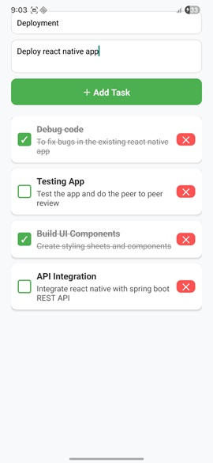
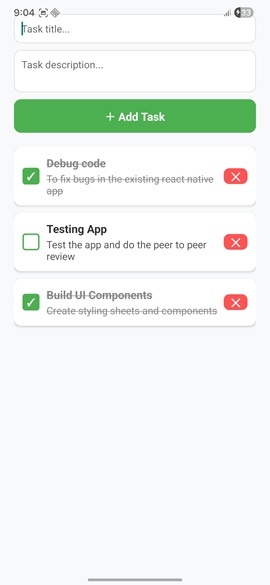
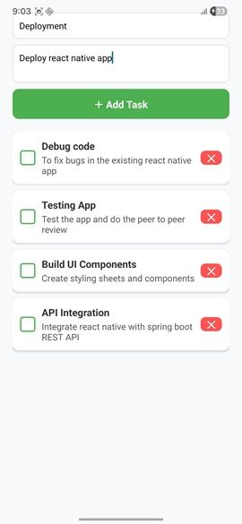

# 📝 Task Manager - React Native

A simple **Task Manager app** built with React Native.  
Users can:
- Add tasks
- Mark tasks as complete (with strikethrough)
- Delete tasks

---

## 🚀 Features
- Add new tasks with a description
- 
- Toggle tasks as **complete/incomplete**
- 
- Delete tasks
- 
- View tasks
- 
- Clean UI with visual feedback

---

## ⚡ Installation & Setup

## ⚡ Prerequisites

Make sure you have the following installed:

- [Node.js (LTS 20.x)](https://nodejs.org/)
- [Java JDK 17](https://adoptium.net/)
- [Yarn](https://classic.yarnpkg.com/en/docs/install/) (optional but recommended)
- [Android Studio](https://developer.android.com/studio) (for Android)
- [Xcode](https://developer.apple.com/xcode/) (for iOS, macOS only)

### 1. Clone the Repository
```bash
git clone https://github.com/<username>/<repo>.git
cd <repo>

Running the App
Start Metro Bundler: npx react-native start
Run on Android: npx react-native run-android:wq
:

